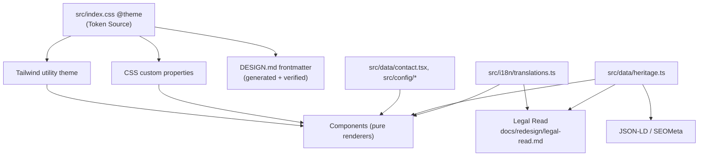
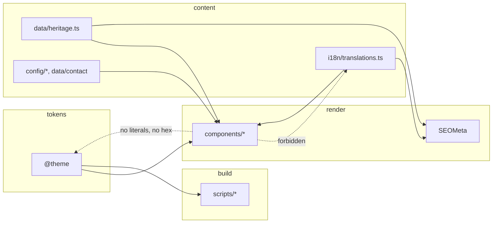

# Architecture Spine — proksiabel.ee "The Adversary" rebrand

## Design Paradigm

**Content-as-data presentation layer over a single-source design token block.**

Two rails, and every decision below hangs off one of them:

- **Content-as-data.** Every user-visible string and every factual claim lives in a typed
  data module. Components are pure renderers over that data. This is not a style
  preference — it is what makes the Legal Read (FR-20) a file review instead of a
  component sweep, and what makes ET/EN parity checkable by the compiler.
- **Single-source tokens.** One authored `@theme` block drives colour, type, spacing,
  motion. Consumers are generated or verified from it; none are hand-maintained.



Directory mapping: `src/design|index.css` = token rail. `src/data/`, `src/i18n/`,
`src/config/` = content rail. `src/components/` = renderers. `scripts/` = build chain.
`docs/redesign/` = governance artifacts.

## Invariants & Rules

### AD-1 — The Token Source is the Tailwind v4 `@theme` block, not a separate token file `[ADOPTED]`

- **Binds:** FR-4, FR-5, FR-6, FR-22, FR-23, FR-25, SM-4
- **Prevents:** building a `tokens.json` → generator → CSS + Tailwind pipeline that
  reimplements a native Tailwind v4 feature, and the two-sources-of-truth bug that
  follows when the generator output and the hand-edited `@theme` diverge.
- **Rule:** `src/index.css`'s `@theme` block is the single authored token set. Tailwind v4
  CSS-first config already emits both the CSS custom properties and the utility theme from
  it. Do **not** introduce `src/design/tokens.json` or `tokens.ts` as a parallel source. New
  tokens (hazard, toxic, motion durations, easings) are added to `@theme`.

> **Conflict with the PRD, surfaced not overridden:** FR-22/FR-23 specify
> `src/design/tokens.*` plus a `build:tokens` script. That mechanism was written before the
> repo's Tailwind v4 CSS-first setup was inspected. The FR *intent* — one authored source,
> generated consumers, no raw hex in components, docs that cannot drift — is fully met by
> AD-1 + AD-2. The PRD's named file path and script are superseded. PRD Open Question 5
> ("tokens.json or tokens.ts?") is answered: neither.

### AD-2 — `DESIGN.md` token frontmatter is generated from the Token Source and verified in the build

- **Binds:** FR-24, SM-4
- **Prevents:** the actual drift this project has — `DESIGN.md` frontmatter duplicates every
  colour and type value by hand today, so a palette change silently desyncs the document
  every agent reads before designing.
- **Rule:** one script (`scripts/sync-design-tokens.js`) parses `@theme` and writes the
  `colors:`/`typography:` frontmatter of `DESIGN.md`. A `--check` mode exits non-zero on
  drift and runs inside the Verify Gate. The generator is one-way: `@theme` → `DESIGN.md`,
  never the reverse.

### AD-3 — No raw hex, and no literal user-visible copy, in components

- **Binds:** FR-8, FR-9, FR-14, FR-20, FR-22, SM-1, SM-4
- **Prevents:** claim-bearing text and colour values scattering across JSX, which would make
  both the Legal Read and the token single-sourcing unenforceable by inspection.
- **Rule:** components reference tokens via Tailwind utilities or `var(--…)`, and strings via
  `useTranslation()` keys or a data module. A literal hex or a literal user-visible sentence
  in `src/components/` is a defect, not a style nit.

### AD-4 — ET/EN parity is type-enforced

- **Binds:** FR-8, FR-14, SM-5
- **Prevents:** the current silent failure — `translations.ts` is a single `as const` object
  whose `en` and `et` shapes are inferred independently, so a missing or misspelled ET key
  compiles clean and ships as a gap.
- **Rule:** `en` defines the shape; `et` is declared to satisfy it
  (`const et: typeof en = { … }`, or `translations` typed so both locales share one key
  shape). A missing ET key must fail `tsc -b`. The same rule applies to the Heritage model:
  `body_en` and `body_et` are both required, non-optional fields.

### AD-5 — Claim-bearing content lives in data modules the Legal Read can be run against

- **Binds:** FR-14, FR-15, FR-18, FR-20, FR-21, SM-1
- **Prevents:** a governance gate that is theatre — a sign-off covering "the copy" with no
  fixed set of files that constitutes the copy.
- **Rule:** the Heritage narrative lives in `src/data/heritage.ts` as
  `{ year, title, body_en, body_et, sources[], grey_zone }[]`. `sources` is non-empty and
  `grey_zone: true` entries must be past tense. Third-party factual claims elsewhere
  (Dossier, JSON-LD, meta) also resolve to a data module or a translation key. The Legal
  Read enumerates those files; nothing claim-bearing lives outside them.

### AD-6 — The Heritage model has three consumers and no divergent copy

- **Binds:** FR-14, FR-18, FR-20
- **Prevents:** the heritage story being retold — and drifting — separately in the component,
  in JSON-LD, and in the legal sign-off.
- **Rule:** `Heritage.tsx`, the `Organization`/`Person` JSON-LD in `SEOMeta.tsx`, and the
  Legal Read all read `src/data/heritage.ts`. Adding a timeline entry requires no component
  edit and no structured-data edit.

### AD-7 — Motion is a token, and no meaning lives only in motion

- **Binds:** FR-6, FR-11, FR-14, FR-27, NFR reduced-motion, SM-C2
- **Prevents:** per-component ad-hoc animation that cannot be globally audited or globally
  disabled — and an aggressive design that degrades to a bland one under
  `prefers-reduced-motion`.
- **Rule:** durations and easings are `@theme` tokens. Every animation sits behind a
  `prefers-reduced-motion` guard, expressed once as a shared CSS convention rather than
  re-implemented per component. The reduced-motion render must carry the same information
  and comparable emphasis; content revealed by scroll-driven motion must be present and
  ordered without it.

### AD-8 — Zero third-party network origins, build-time and runtime

- **Binds:** FR-5, FR-25, NFR privacy/GDPR
- **Prevents:** a CDN font or asset creeping in during a visual push and re-introducing a
  GDPR exposure that was deliberately removed.
- **Rule:** fonts ship as `@fontsource-*` npm packages, self-hosted from the origin. No
  script, style, font, image, or analytics may load from a third-party host. The token
  scripts fetch nothing. Any new dependency that injects a remote origin at runtime is
  rejected at review.

### AD-9 — Prerender is sitemap-driven; routes and sitemap move together

- **Binds:** FR-26, FR-29
- **Prevents:** a route that renders in dev, ships as an empty SPA shell in `pub/`, and
  quietly loses its SEO — the failure mode this build chain already has.
- **Rule:** `scripts/prerender.js` derives its route list from `pub/sitemap.xml`. Any route
  added to `App.tsx` is added to the sitemap in the same change. The prerendered page count
  is asserted in the Verify Gate.

### AD-10 — The Verify Gate is one command chain, and the Legal Read blocks separately

- **Binds:** FR-20, FR-26, FR-27, FR-29, SM-1, SM-2
- **Prevents:** mechanical green being mistaken for releasable — a page can compile, lint,
  build and prerender perfectly while carrying an uncited claim.
- **Rule:** two independent gates. **Mechanical:** `pnpm exec tsc -b && pnpm exec biome check
  && pnpm exec vite build`, plus the token-parity check (AD-2) and prerender count (AD-9).
  **Editorial:** a dated Legal Read entry in `docs/redesign/legal-read.md` for the epic.
  Both must pass. Neither substitutes for the other.

### AD-11 — `DESIGN.md` states which regime binds `[ADOPTED]`

- **Binds:** FR-3, FR-2, and every design story executed by an agent
- **Prevents:** the highest-probability failure of this rebrand — a downstream agent reading
  `DESIGN.md`, finding the superseded "Don'ts" (no terminals, one signal rule, restrained
  motion), and dutifully enforcing the brand this work exists to replace.
- **Rule:** `DESIGN.md` carries the Adversary thesis in `name`/`description`, the Voice block
  (FR-2), and the old thesis under an explicit **Superseded — not binding** heading. Any
  prohibition retained from the old regime is restated affirmatively under the new one or it
  does not bind.



Dependency direction: content and tokens are depended **upon**; they never import from
`components/`. `scripts/` may read `src/` sources but is never imported by them.

## Consistency Conventions

| Concern | Convention |
| --- | --- |
| Naming — tokens | `--color-*`, `--font-*`, `--duration-*`, `--ease-*` in `@theme`; semantic role names (`signal-critical`, `hazard`), never literal colour names |
| Naming — components | One PascalCase component per file in `src/components/`; new section components sit at the top level, primitives under `src/components/ui/` |
| Naming — sections | The operator lexicon is fixed vocabulary: ARSENAL, TARGET INTAKE, KILL CHAIN, PROOF. One term per surface, used identically in nav, section heading, and copy |
| Data & formats | Content models are plain typed objects exported from `src/data/`; `sources` is `string[]` of URLs; `year` is a display string, not a Date |
| i18n | Every user-visible string is a `translations.ts` key. `en` defines the shape; `et` must satisfy it. No fallback rendering of `en` inside an ET page |
| State | Language is the only global state (`LanguageContext`); everything else is local component state. No new global store |
| Motion | Tokenised durations/easings; single shared `prefers-reduced-motion` convention; no per-component media query duplication |
| Errors | `ErrorBoundary` stays the top-level boundary; form validation states are explicit and reachable, no silent failures |
| Governance | Each epic appends a dated entry to `docs/redesign/legal-read.md` naming the files reviewed and the verdict |

## Stack

| Name | Version |
| --- | --- |
| React | 19.2 |
| TypeScript | 7.0 |
| Vite | 8.2 (build `outDir: pub`) |
| Tailwind CSS | 4.3 (CSS-first `@theme`) |
| react-router-dom | 7.18 |
| Biome | 2.5 (+ oxlint 1.79) |
| @fontsource-variable (Geist, Inter Tight, JetBrains Mono) | 5.3 |
| puppeteer-core (prerender) | 25.8 |
| Node / pnpm | Node 20 / pnpm 10 (CI-pinned) |
| Hosting | GitHub Pages, custom domain via `pub/CNAME`, Cloudflare DNS-only |

## Structural Seed

```text
src/
  index.css          # @theme — THE Token Source (AD-1)
  data/
    heritage.ts      # NEW — Heritage Timeline model (AD-5, AD-6)
    contact.tsx
  i18n/
    translations.ts  # en shape + et satisfying it (AD-4)
  components/
    Heritage.tsx     # NEW — pure renderer over data/heritage.ts
    Hero.tsx, AttackVectorGraph.tsx, Services.tsx, Dossier.tsx,
    DispatchTerminal.tsx, SEOMeta.tsx, Navbar.tsx, Footer.tsx
    ui/
scripts/
  sync-design-tokens.js  # NEW — @theme -> DESIGN.md, with --check (AD-2)
  prerender.js           # sitemap-driven (AD-9)
  postbuild-seo.js
docs/redesign/
  manifesto.md     # NEW (FR-1)
  legal-read.md    # NEW — the blocking editorial gate (AD-10)
DESIGN.md          # thesis + Voice + generated token block (AD-2, AD-11)
```

## Capability → Architecture Map

| Capability / Area | Lives in | Governed by |
| --- | --- | --- |
| FR-1..FR-3 Positioning & voice | `docs/redesign/manifesto.md`, `PRODUCT.md`, `DESIGN.md` | AD-11 |
| FR-4..FR-6 Palette, type, motion | `src/index.css` `@theme` | AD-1, AD-2, AD-7, AD-8 |
| FR-7, FR-16 Operator Terminal / Target Intake | `DispatchTerminal.tsx`, `config/pgp.ts`, `data/contact.tsx` | AD-3, AD-4 |
| FR-8..FR-10 Copy & lexicon | `i18n/translations.ts` | AD-3, AD-4, lexicon convention |
| FR-11..FR-12 Hero & AiTM diagram | `Hero.tsx`, `AttackVectorGraph.tsx` | AD-3, AD-5, AD-7 |
| FR-13 Arsenal | `Services.tsx` | AD-3, AD-5 |
| FR-14 Heritage | `data/heritage.ts` → `Heritage.tsx` | AD-5, AD-6, AD-4 |
| FR-15 Dossier | `Dossier.tsx`, `Disclosure.tsx` | AD-5 |
| FR-17 Guides | `SsrfGuide/IdorGuide/Fido2PasskeysGuide.tsx` | AD-1, AD-3 |
| FR-18..FR-19 SEO & wordmark | `SEOMeta.tsx`, `index.html`, `Navbar/Footer` | AD-6, AD-9 |
| FR-20..FR-21 Governance | `docs/redesign/legal-read.md` | AD-5, AD-10 |
| FR-22..FR-25 Token pipeline | `src/index.css`, `scripts/sync-design-tokens.js` | AD-1, AD-2, AD-8 |
| FR-26..FR-29 Verify & deploy | `package.json` scripts, `scripts/*`, `pub/CNAME` | AD-9, AD-10 |

## Deferred

- **Which display face** (PRD OQ-1) — a type decision, not a structural one. AD-1 makes it a
  one-line `@theme` change either way; AD-8 constrains it to self-hosted npm.
- **`Heritage.tsx` new vs. extending `Dossier.tsx`** (PRD OQ-2) — component boundary,
  decided at story time. AD-5/AD-6 bind regardless of which file renders it.
- **Citation count for grey-zone entries** (PRD OQ-3) — editorial policy for the Legal Read,
  not architecture. AD-5 only requires `sources` non-empty.
- **Legal Read reviewer identity** (PRD OQ-4) — process. AD-10 requires the artifact exists
  and blocks; who signs is the operator's call.
- **ET validation granularity** (PRD OQ-6) — AD-4 enforces *presence* mechanically; the
  quality bar and evidence format are a story-level convention.
- **Any CMS or authoring UI for heritage entries** — explicitly out of MVP; AD-5's model is
  the interface a UI would later sit on.
- **Analytics / conversion measurement** — no measurement dimension exists in this system,
  by choice (AD-8). SM-6 is qualitative for that reason.
- **Performance budgets as enforced numbers** — the Verify Gate asserts build success and
  prerender count, not byte or timing budgets. Add when the aggressive treatment measurably
  regresses first paint.
